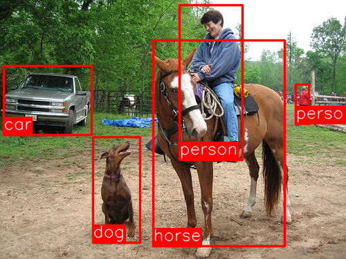

# Object-Detection-SSD
<hr>
## Intro

Detecting Multiple objects in a video using Single Shot Multibox Detector

Weight Files are splitted as
<ol>
    <li>ssd300_mAP_77.43_v2.pth.000</li>
    <li>ssd300_mAP_77.43_v2.pth.001</li>
    <li>ssd300_mAP_77.43_v2.pth.002</li>
    <li>ssd300_mAP_77.43_v2.pth.003</li>
    <li>ssd300_mAP_77.43_v2.pth.004</li>
</ol>

Join weight files [Here](http://pinetools.com/join-files)

If this doesn't work.
Download weight files [here](http://pjreddie.com/darknet/yolo/)

Read more about SSD [here](hhttps://arxiv.org/pdf/1512.02325.pdf)


Click on this image to see demo from SSD:

[](http://i.imgur.com/EyZZKAA.gif)

## Dependencies

Check ut the  ### virtual_platform_windows.yml

### Getting started

Create a virtual platform.
    ```
    conda env create -f virtual_platform_windows.yml
    ```

## Testing

**Android demo on Tensorflow's** [here](https://github.com/tensorflow/tensorflow/blob/master/tensorflow/examples/android/src/org/tensorflow/demo/TensorFlowYoloDetector.java)

**I am looking for help:**
 - `help wanted` labels in issue track


##  Getting data set for Training a new model

Training is simple but GPU `CUDA` is mandatory otherwise it will take months to train on a CPU:

```bash
#Get the dataset:
[Here](http://host.robots.ox.ac.uk/pascal/VOC/index.html)
```

During training, the script will occasionally save intermediate results into Tensorflow checkpoints, stored in `ckpt/`. To resume to any checkpoint before performing training/testing, use `--load [checkpoint_num]` option, if `checkpoint_num < 0`, `darkflow` will load the most recent save by parsing `ckpt/checkpoint`.


Credits for this code go to [https://github.com/thtrieu](https://github.com/thtrieu). I've merely created a wrapper to get people started.
